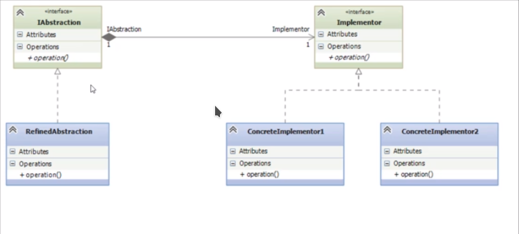

## Bridge

Decorator es un patrón de diseño estructural que te permite dividir una clase grande, o un grupo de clases estrechamente relacionadas, en dos jerarquías separadas (abstracción e implementación) que pueden desarrollarse independientemente la una de la otra.

Este patron practicamente es un puente, separando una implementación de una clase que va a hacer uso de esta implementación y se va a tener una interfaz que va a definir la abstracción y otra interfaz que va a definir el implementador. El implementador es el funcionamiento nativo, el funcionamiento mas pequeño, el funcionamiento mas separado, el cual es utilizado por una abstracción la cual es lo mas acercado al modelo de negocio 

Un ejemplo de este patron puede ser el crear una clase que se base en generar varios encoders como puede ser el codificar a base64, pasar a HTML, etc. 
